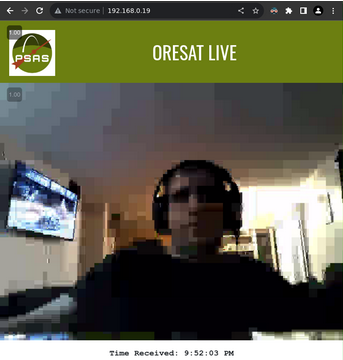

# Table of Contents:
- [Server](#server)
  - [Setup Hardware and Install Prerequisites on Compatible System](#setup-hardware-and-install-prerequisites-on-compatible-system)
    - [Connect Hardware, Download/Write the RPI Image and SSH in](#connect-hardware-downloadwrite-the-rpi-image-and-ssh-in)
    - [Make Sure Wifi Card is Working](#make-sure-wifi-card-is-working)
    - [Install System Dependencies](#install-system-dependencies)
  - [Setup Source Directories](#setup-source-directories)
  - [Build and Install oresat-live-software packages](#build-and-install-oresat-live-software-packages)
    - [Check Services After Reboot](#check-services-after-reboot)
  - [Usage](#usage)

# server

The software in this folder creates a Node.js web server to host OreSat Live streams.

## Setup Hardware and Install Prerequisites on Compatible System

At the time of this writing a compatible system is the [RPI 3B](https://www.raspberrypi.com/products/raspberry-pi-3-model-b/), using the [raspios_lite_arm64-2023-05-03/2023-05-03-raspios-bullseye-arm64-lite.img.xz] (https://downloads.raspberrypi.org/raspios_lite_arm64/images/raspios_lite_arm64-2023-05-03/2023-05-03-raspios-bullseye-arm64-lite.img.xz) image, running the [Debian GNU/Linux 11 (bullseye)](https://www.debian.org/releases/bullseye/) distro on [arm64](https://stackoverflow.com/questions/37790029/what-is-difference-between-arm64-and-armhf) dpkg architecture.

NOTE: The latest version may have a different URL, so treat this URL below as an example. You can get the latest image from [here](https://www.raspberrypi.com/software/operating-systems/#raspberry-pi-os-64-bit) by right-clicking the “Download” button next to “Raspberry Pi OS Lite” and copying the link and running the equivalent wget command below.

Using whichever is the correct latest RPI 3B compatible image, you can download the image and confirm its sha256 sum like this:

### Connect Hardware, Download/Write the RPI Image and SSH in
```
$ wget 'https://downloads.raspberrypi.org/raspios_lite_arm64/images/raspios_lite_arm64-2023-05-03/2023-05-03-raspios-bullseye-arm64-lite.img.xz'

$ sha256sum 2023-05-03-raspios-bullseye-arm64-lite.img.xz
bf982e56b0374712d93e185780d121e3f5c3d5e33052a95f72f9aed468d58fa7 2023-05-03-raspios-bullseye-arm64-lite.img.xz
```

You will then need to write the image to the RPI3 using something like the [RPI imager](https://www.raspberrypi.com/news/raspberry-pi-imager-imaging-utility/)

After you have done this, logged in and set up a user and plugged in the atheros wifi adapter and connected to the host via SSH, you should be able to ensure the prerequisite requirements for this package with the following commands.


### Make Sure Wifi Card is Working

Make sure the following configs are written on disk by running the following commands:
```
$ sudo su -l
# cat <<EOF > /etc/systemd/network/50-ath9k-htc.link
[Match]
Driver=ath9k_htc
[Link]
Name=mon0
EOF

# cat <<EOF > /etc/network/interfaces.d/downlink
auto mon0
iface mon0 inet manual
pre-up ip link set mon0 down
pre-up iw dev mon0 set monitor fcsfail otherbss
pre-up ip link set mon0 up
pre-up iw dev mon0 set channel 3
EOF

# echo "denyinterfaces mon0" >> /etc/dhcpcd.conf
```

NOTE: The debian ath9k-htc driver does not enable CONFIG_ATH9K_HTC_DEBUGFS=y, which is a nice-to-have, because it exposes a bunch of information about the state of the driver to userspace.  If you find you need this, you may rebuild the kernel using that config option using [these instructions](https://www.raspberrypi.org/documentation/linux/kernel/building.md)

After doing this you will want to reboot the system to have all the changes take effect:

```
sudo reboot now
```


### Install System Dependencies

As pi user run the following commands to install the prereqs:
```
sudo apt-get -y install firmware-ath9k-htc tcpdump build-essential git usbutils cmake vim libpcap-dev libgpiod-dev pybind11-dev python3-dev
```


## Setup Source Directories

Run these commands to set up the source directories for this repo:

```
mkdir ~/src && \
  cd ~/src/ && \
  git clone https://github.com/oresat/oresat-live-software.git
```


## Build and Install oresat-live-software packages

Run these commands to build and install oresat-live-software:

```
cd ~/src/oresat-live-software/server && ./build-deb.sh && sudo dpkg -i ./oresat-live-software-server-*.deb
```

After installing you will want to reboot the system to have all the changes take effect:

```
sudo reboot now
```

### Check Services After Reboot

After the reboot to check the status of the RX service:

```
pi@raspberrypi:~ $ systemctl status oresat-live-software-rx.service
● oresat-live-software-rx.service - OreSat Live Software RX Service
 Loaded: loaded (/lib/systemd/system/oresat-live-software-rx.service; disabled; vendor preset: enabled)
 Active: active (running) since Wed 2023-09-06 07:24:30 BST; 27s ago
Process: 472 ExecStartPre=mkdir -p public/video (code=exited, status=0/SUCCESS)
Main PID: 479 (bash)
Tasks: 2 (limit: 779)
CPU: 127ms
CGroup: /system.slice/oresat-live-software-rx.service
 ├─479 /usr/bin/bash rx.sh mon0 ./public/video/
 └─499 /usr/bin/rx --dev mon0 ./public/video/ -e mp4 -v
Sep 06 07:24:32 raspberrypi bash[499]: Packet Buffer Size: 5242880
Sep 06 07:24:32 raspberrypi bash[499]: Max Hamming Distance: 5
Sep 06 07:24:32 raspberrypi bash[499]: Ordered: 0
Sep 06 07:24:32 raspberrypi bash[499]: Add-noise: 0
Sep 06 07:24:32 raspberrypi bash[499]: Filter: (null)
Sep 06 07:24:32 raspberrypi bash[499]: Optimize: 1
Sep 06 07:24:32 raspberrypi bash[499]: Snapshot Length: 65535
Sep 06 07:24:32 raspberrypi bash[499]: PCAP Buffer Timeout: 20ms
Sep 06 07:24:32 raspberrypi bash[499]: Dispatch Count: 1
Sep 06 07:24:32 raspberrypi bash[499]: Datalink Type: 802.11 plus radiotap header
```

NOTE: The rx binary currently has bugs which cause it to crash due to double free, failed munmap and invalid pointer errors.  Currently the workaround solution for this is to keep restarting rx every time it crashes through systemd service settings but this is not a good long term solution and an excellent candidate for a future fix.

To check the status of the HGS webapp service:

```
$ systemctl status oresat-live-software-server.service
● oresat-live-software-server.service - OreSat Live Software Web Service
Loaded: loaded (/lib/systemd/system/oresat-live-software-server.service; enabled; vendor preset: enabled)
Active: active (running) since Wed 2023-09-06 07:30:54 BST; 2min 20s ago
Process: 518 ExecStartPre=/usr/bin/npm i (code=exited, status=0/SUCCESS)
Main PID: 723 (node)
Tasks: 7 (limit: 779)
CPU: 10.144s
CGroup: /system.slice/oresat-live-software-server.service
└─723 /usr/bin/node index.js video/
Sep 06 07:30:41 raspberrypi systemd[1]: Starting OreSat Live Software Web Service…
Sep 06 07:30:53 raspberrypi npm[518]: up to date, audited 62 packages in 10s
Sep 06 07:30:54 raspberrypi npm[518]: 3 high severity vulnerabilities
Sep 06 07:30:54 raspberrypi npm[518]: To address all issues, run:
Sep 06 07:30:54 raspberrypi npm[518]: npm audit fix
Sep 06 07:30:54 raspberrypi npm[518]: Run `npm audit` for details.
Sep 06 07:30:54 raspberrypi systemd[1]: Started OreSat Live Software Web Service.
Sep 06 07:30:55 raspberrypi node[723]: Server is running on http://0.0.0.0:80
```


## Usage

To use the app, you will simply need to direct your browser to the IP of the RPI.

Head over to the browser using the URL http://192.168.0.18, where 192.168.0.18 is the standin for the IP of the RPI where the HGS app is running, and you if you have a successful transmission coming in you will see something like this:



NOTE: For full instructions on how to do an end-to-end transmission test see [oresat-dxwifi-software](https://github.com/oresat/oresat-dxwifi-software)

Otherwise you will see a holding pattern of waiting for transmission:


